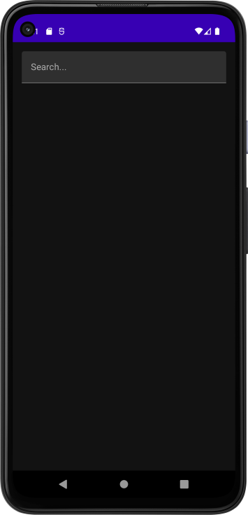
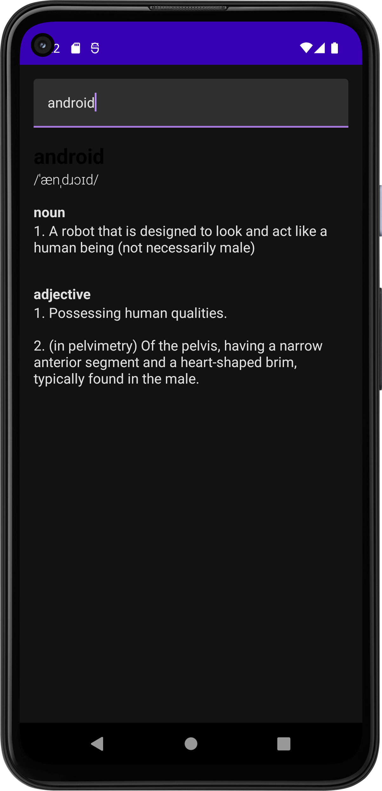

# Dictionary App
- An app that lets the user search for thru dictionary for words. It uses the "Free Dictionary API". 
- Words are cached to a Room Database. It no connection exists, the Api will still work 
when searching for words that have been saved to Room Database.

## We use 
- Clean Architecture, MVVM, Use Cases, Compose, Rest API, Dagger-Hilt, Coroutines)

### Codelab from Philipp Lackner
https://www.youtube.com/watch?v=Mr8YKDh3li4&t=326s&ab_channel=PhilippLackner

- Fixed all Dependencies to be current.
- Lots of fixes in DTO code. The API has changed and dropped some friends since tutorial

  
  

ref: dictionary-app-android-kotlin-compose
